# @rongyan/mermaid-plus-cli

Convert mermaid diagrams in markdown or `.mmd` files to **beautiful PNG or SVG images**, using [beautiful-mermaid](https://github.com/lukilabs/beautiful-mermaid) for high-quality SVG rendering and your system Chrome for pixel-perfect screenshots.

- **More beautiful** than [mermaid-cli](https://github.com/mermaid-js/mermaid-cli) — powered by beautiful-mermaid's carefully crafted themes
- **PNG export** on top of beautiful-mermaid's SVG-only output
- **Lightweight** — uses your existing Chrome installation, no bundled Chromium
- Supports CLI, `npx`, and programmatic use

---

## Installation

```bash
npm install -g @rongyan/mermaid-plus-cli
```

Or use without installing:

```bash
npx @rongyan/mermaid-plus-cli article.md
```

---

## Usage

### CLI

```bash
# Markdown mode — converts all mermaid blocks to images, updates the file in-place
mmdpc article.md [assets-dir]

# Single diagram mode — .mmd or .mermaid file to PNG/SVG
mmdpc diagram.mmd -o diagram.png
mmdpc diagram.mmd -o diagram.svg          # SVG output (no Chrome needed)

# Explicit flags
mmdpc -i article.md -a ./assets --theme github-dark --scale 3
```

### npx

```bash
npx @rongyan/mermaid-plus-cli article.md ./assets --theme nord
```

### Programmatic API

```javascript
import { convertMarkdown, convertMermaid, THEMES } from '@rongyan/mermaid-plus-cli'

// Convert all mermaid blocks in a markdown file → PNGs, updates file in-place
await convertMarkdown('article.md', './assets', {
  theme: 'github-dark',
  scale: 2,
})

// Convert a single mermaid code string → PNG
await convertMermaid('flowchart LR\n  A --> B --> C', 'diagram.png', {
  theme: 'nord',
  width: 800,
})

// SVG output — no Chrome required
await convertMermaid('flowchart LR\n  A --> B', 'diagram.svg', {
  theme: 'catppuccin-mocha',
})

// Inspect available themes
console.log(Object.keys(THEMES))
```

---

## Options

| Flag | Default | Description |
|------|---------|-------------|
| `-i, --input <file>` | — | Input file (`.md` or `.mmd`) |
| `-o, --output <file>` | auto | Output file path (single-diagram mode) |
| `-a, --assets <dir>` | `assets` | Image output directory (markdown mode, relative to input file) |
| `-f, --format <fmt>` | `png` | Output format: `png` or `svg` |
| `--theme <name>` | `github-light` | Named theme (see list below) |
| `--bg <color>` | — | Background color override, e.g. `"#ffffff"` |
| `--fg <color>` | — | Foreground / text color override |
| `--font <family>` | — | Font family override |
| `--transparent` | — | Transparent background (PNG alpha or SVG) |
| `--line <color>` | — | Line / edge color override |
| `--accent <color>` | — | Accent / highlight color override |
| `--muted <color>` | — | Muted / secondary text color override |
| `--surface <color>` | — | Node surface / fill color override |
| `--border <color>` | — | Node border color override |
| `--padding <n>` | — | Internal node padding in pixels |
| `--node-spacing <n>` | — | Horizontal node spacing in pixels |
| `--layer-spacing <n>` | — | Vertical layer spacing in pixels |
| `--width <n>` | `1200` | Render width in pixels |
| `--scale <n>` | `2` | Device pixel ratio (2 = Retina) |
| `--chrome <path>` | auto | Path to Chrome/Chromium executable |
| `--font-timeout <ms>` | `8000` | Max wait for web fonts to load |

Color and layout flags override the selected `--theme`. Chrome is auto-detected on macOS, Windows, and Linux.

---

## Themes

15 built-in themes from [beautiful-mermaid](https://github.com/lukilabs/beautiful-mermaid):

| | |
|:---:|:---:|
| 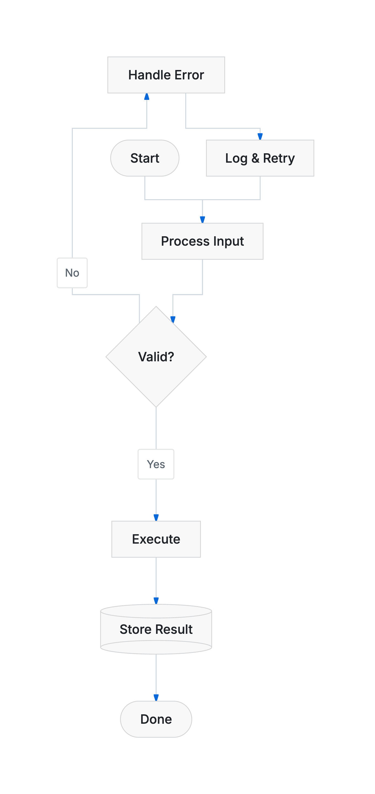<br>`github-light` | 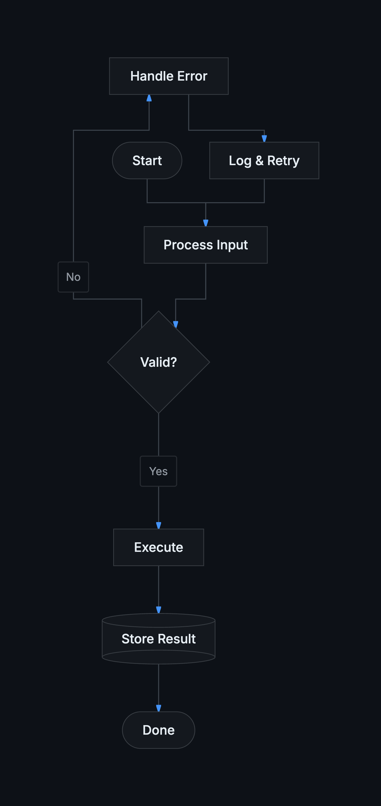<br>`github-dark` |
| 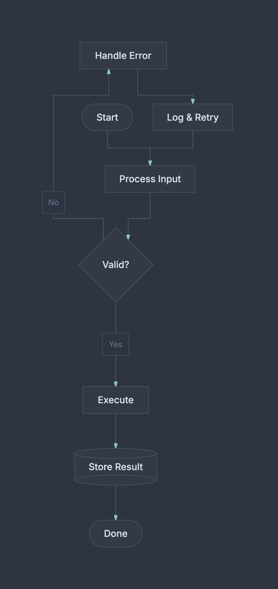<br>`nord` | 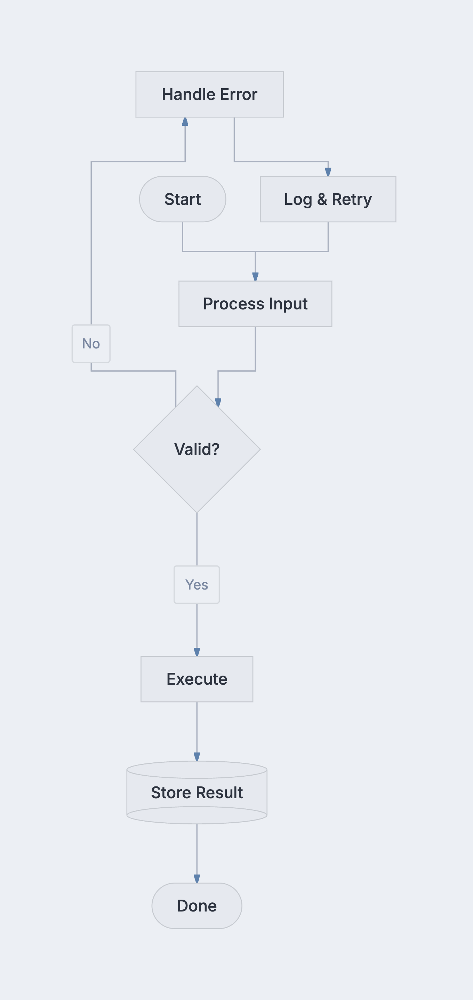<br>`nord-light` |
| 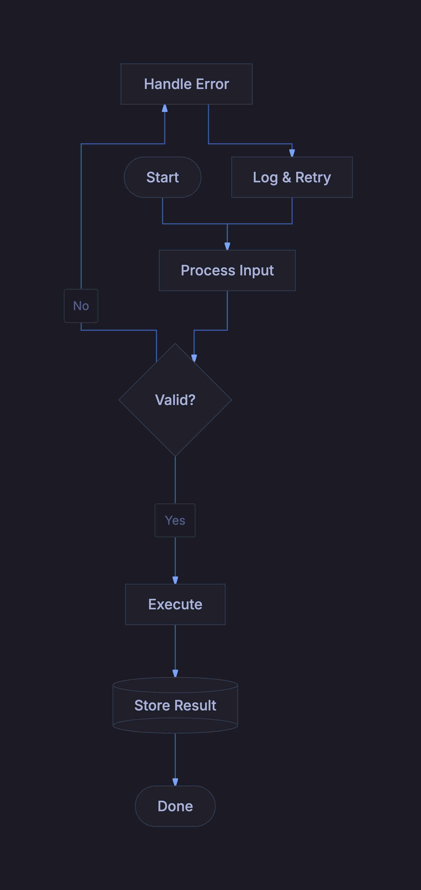<br>`tokyo-night` | 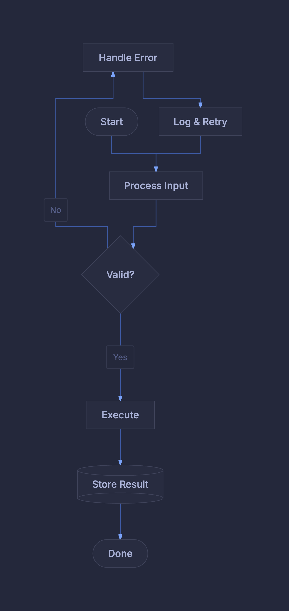<br>`tokyo-night-storm` |
| 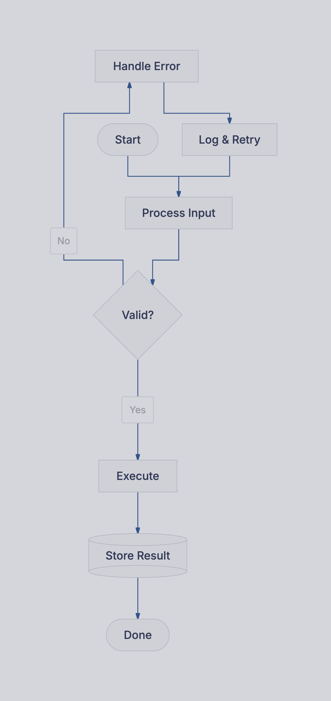<br>`tokyo-night-light` | 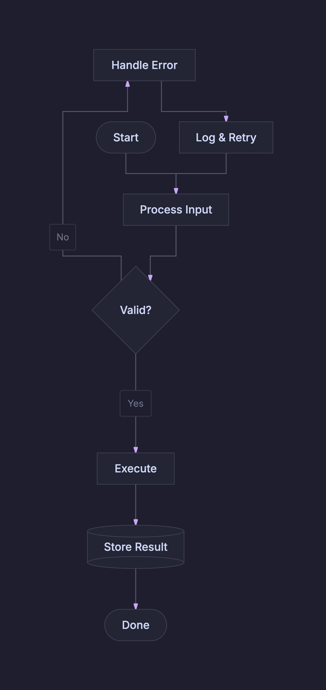<br>`catppuccin-mocha` |
| 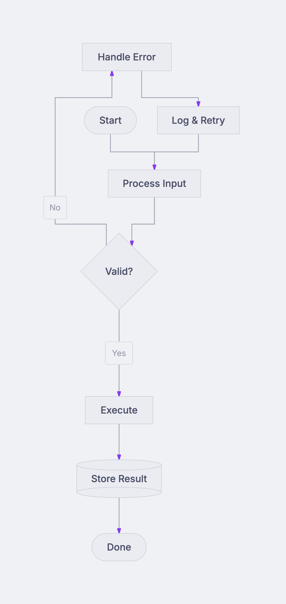<br>`catppuccin-latte` | 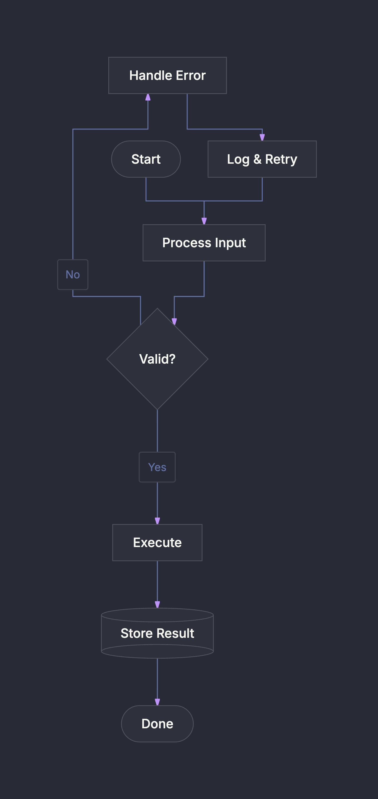<br>`dracula` |
| 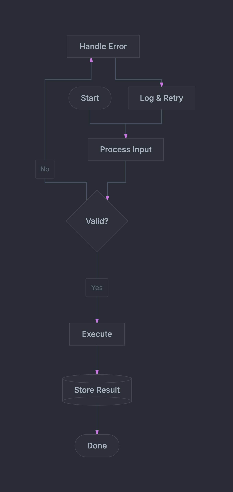<br>`one-dark` | 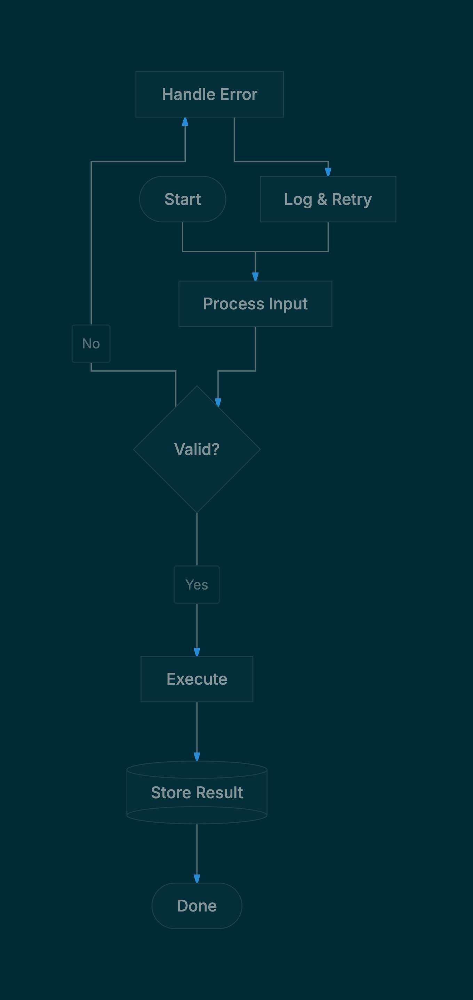<br>`solarized-dark` |
| 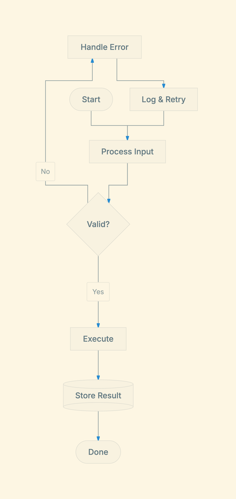<br>`solarized-light` | 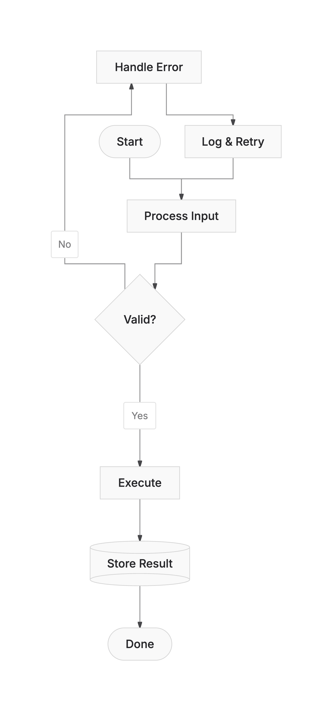<br>`zinc-light` |
| 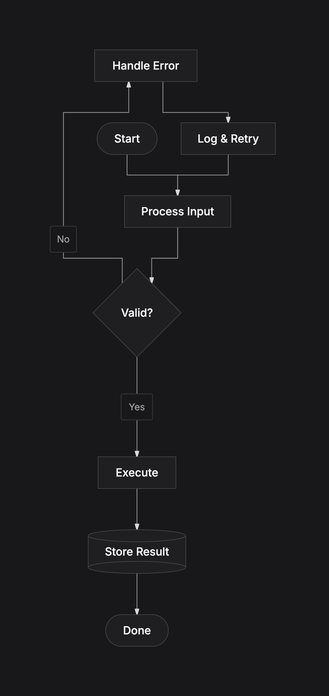<br>`zinc-dark` | |

---

## Requirements

- Node.js ≥ 18
- Google Chrome or Chromium installed on your system (for PNG export)
  - macOS: `/Applications/Google Chrome.app` (auto-detected)
  - Windows: `C:\Program Files\Google\Chrome\Application\chrome.exe` (auto-detected)
  - Linux: `/usr/bin/google-chrome` or `/usr/bin/chromium` (auto-detected)
  - Custom path: `--chrome /path/to/chrome`
- SVG export does **not** require Chrome

---

## License

MIT
